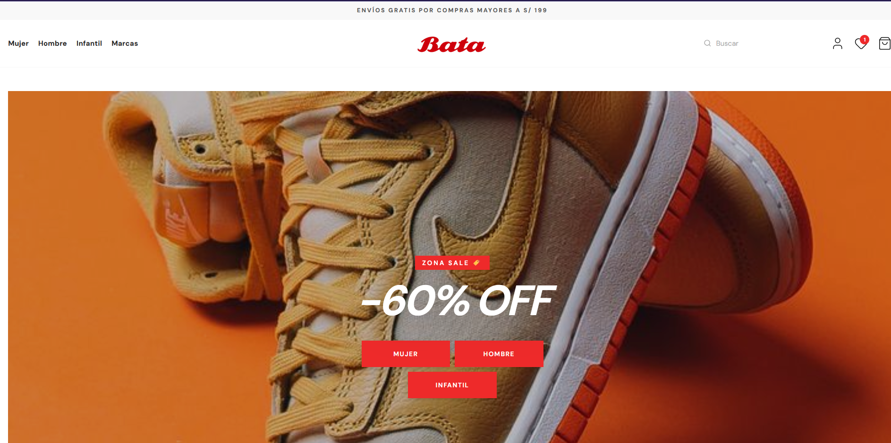
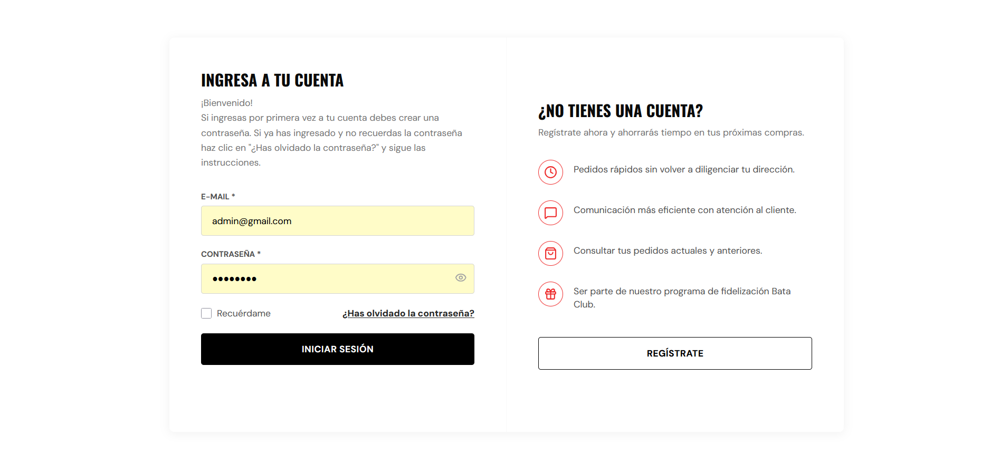
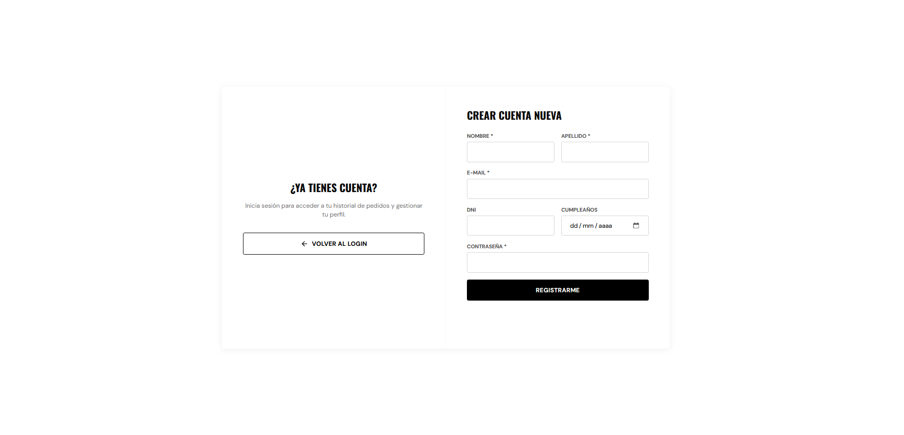
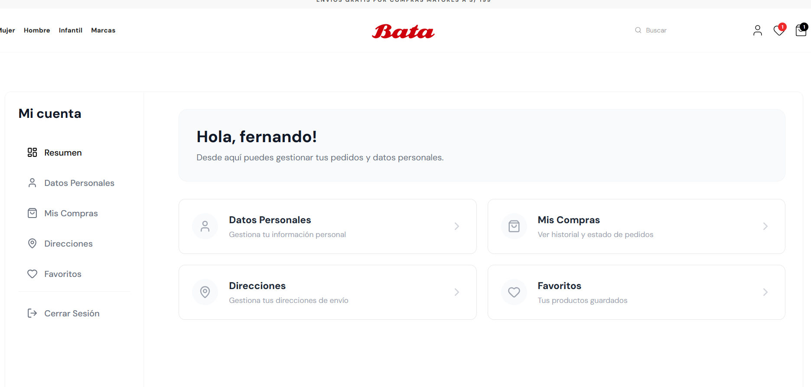
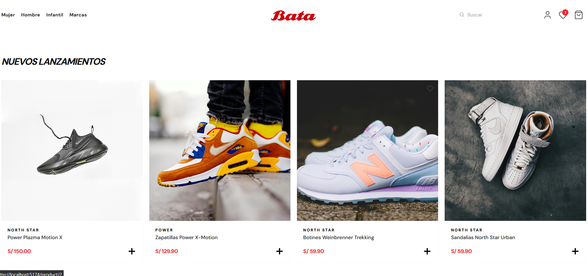
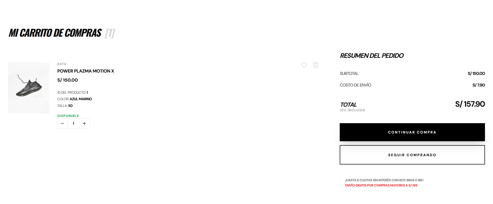
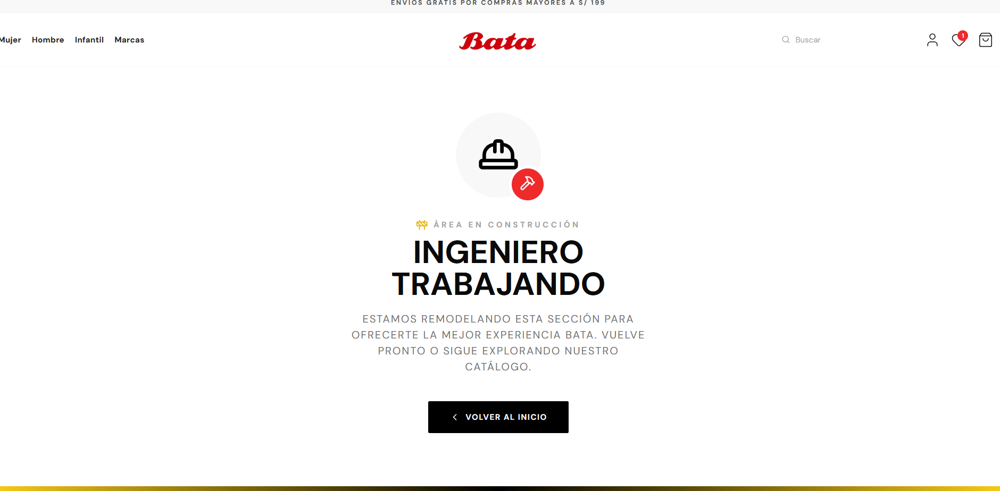

<div align="center">
  
  <br/>
  <br/>

  # Bata Enterprise Replica - Full Stack E-commerce
  
  **Arquitectura Escalable | Seguridad Robusta | Automatización QA**

  [](https://www.java.com/)
  [](https://spring.io/projects/spring-boot)
  [](https://reactjs.org/)
  [](https://www.typescriptlang.org/)
  [](https://www.mysql.com/)

</div>

---

## 🚀 Visión General del Proyecto

**Bata Enterprise Replica** es una solución integral de comercio electrónico diseñada para simular operaciones de retail a gran escala. Este proyecto no es solo una tienda online; es una demostración de ingeniería de software avanzada que abarca desde la gestión transaccional en el Backend hasta una experiencia de usuario optimizada en el Frontend, validada mediante pipelines de automatización.

> **Nota:** Este es un proyecto académico/profesional desarrollado con fines educativos y de demostración técnica.

---

## 📸 Galería del Proyecto

### 🏠 Landing & Autenticación
| Landing Page | Login |
|:---:|:---:|
|  |  |

| Registro | Perfil de Usuario |
|:---:|:---:|
|  |  |

---

### 🛒 Experiencia de Usuario (E-commerce)
| Lista de Productos | Detalle de Producto |
|:---:|:---:|
|  |  |

| Carrito | Detalle del Carrito |
|:---:|:---:|
|  |  |

| Página 404 | — |
|:---:|:---:|
|  | — |

---

### 🛠️ Panel Administrativo & Base de Datos
| Panel Administrativo | Base de Datos |
|:---:|:---:|
|  |  |

---

## 🏗️ Arquitectura del Sistema

El sistema sigue una arquitectura desacoplada (Headless Commerce approach) para garantizar la escalabilidad y mantenibilidad.

### 🔌 Backend (Spring Boot Ecosystem)
Diseñado bajo el patrón **Package by Feature** para alta cohesión.
* **Seguridad:** Implementación de `Spring Security` con **JWT (JSON Web Tokens)** y roles (Admin/User).
* **Persistencia:** `Spring Data JPA` con MySQL. Relaciones complejas (1:N, N:M) y **Cascade Deletes** para integridad referencial.
* **Manejo de Errores:** `GlobalExceptionHandler` (`@ControllerAdvice`) para respuestas HTTP estandarizadas.
* **Integraciones:**
    * `JavaMailSender`: Notificaciones SMTP transaccionales.
    * `Cloudinary API`: Gestión de assets digitales.

### 🎨 Frontend (React + TypeScript)
Estructura **Feature-based** para modularidad.
* **Estilos:** `Tailwind CSS` con diseño **Mobile-First**.
* **Estado:** Context API para gestión de carrito de compras y sesión de usuario.
* **Seguridad:** Interceptores de Axios para manejo de tokens y renovación de sesión.

---

## 🛠️ Stack Tecnológico

### Core
* **Lenguajes:** Java 21, TypeScript, SQL.
* **Frameworks:** Spring Boot 3, React 18.
* **Base de Datos:** MySQL.

### DevOps & Tools
* **Control de Versiones:** Git & GitHub (Flujo Gitflow).
* **Contenedores:** Docker (Futuro).
* **API Testing:** Postman / Swagger UI.
---

## 🗄️ Modelo de Base de Datos (Simplificado)

El sistema maneja una estricta integridad referencial. Ejemplo de relación crítica:

```mermaid
erDiagram
    USER ||--o| LOGIN : credentials
    USER ||--o{ ORDER : places
    PRODUCT ||--|{ VARIANT : has
    VARIANT ||--o{ ORDER_ITEM : contains
