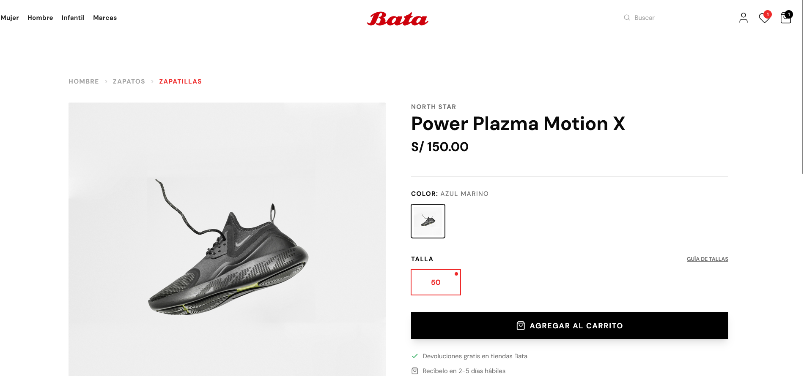
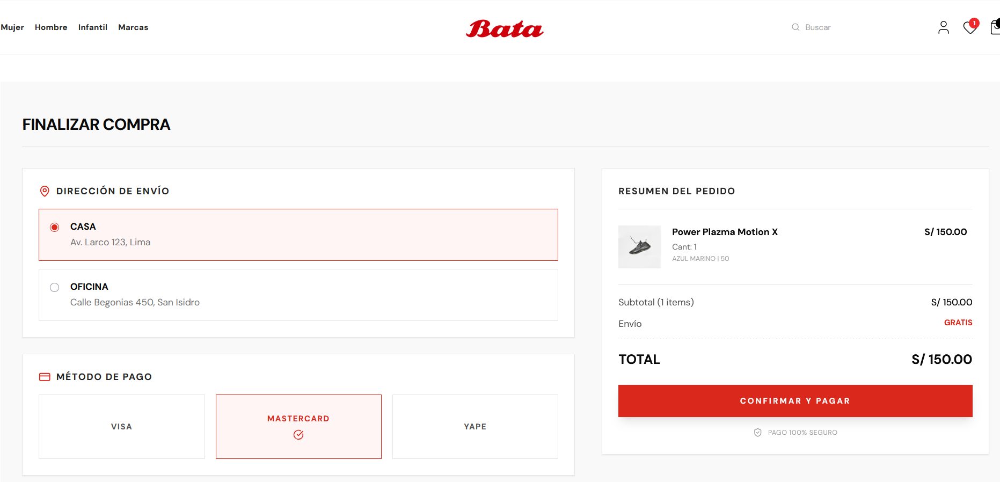
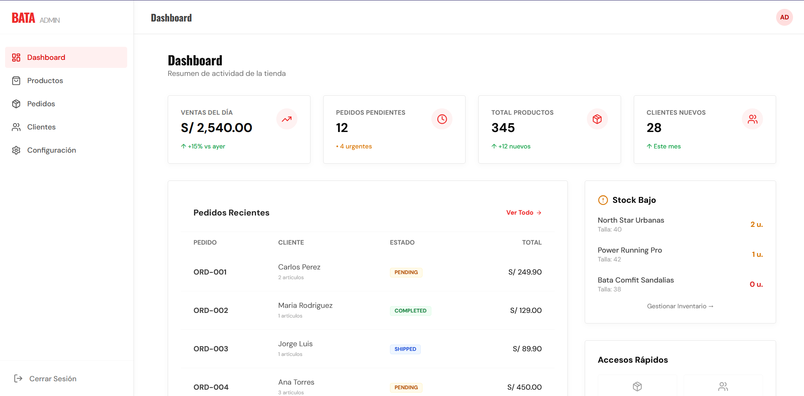
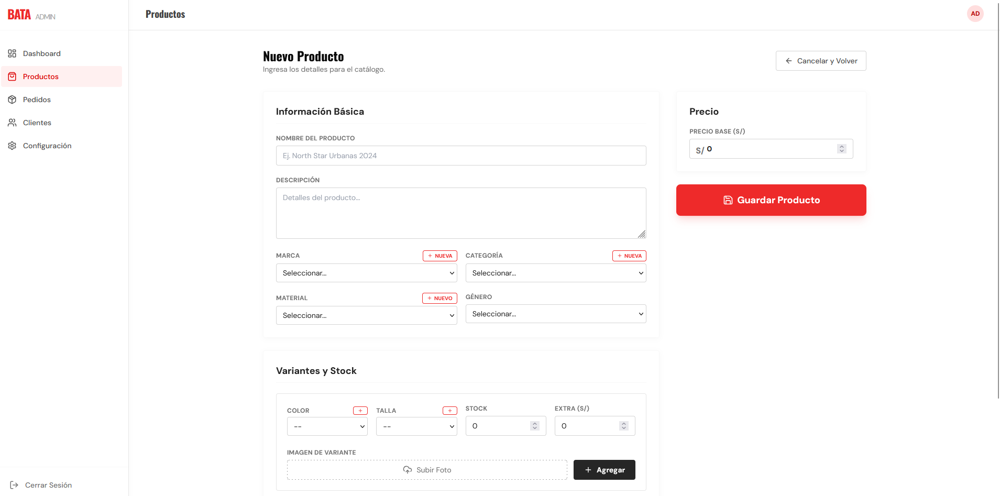
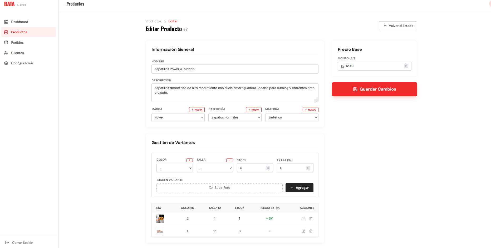
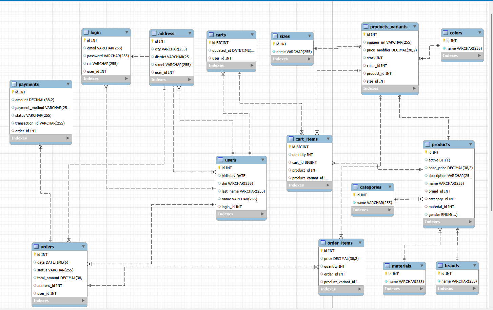

<div align="center">
  
  <br/><br/>

  # Bata Enterprise Replica – Full Stack E-commerce
  
  **Arquitectura Escalable | Seguridad Robusta | Automatización QA**

  [](https://www.java.com/)
  [](https://spring.io/projects/spring-boot)
  [](https://reactjs.org/)
  [](https://www.typescriptlang.org/)
  [](https://www.mysql.com/)
</div>

---

## 🚀 Visión General del Proyecto

**Bata Enterprise Replica** es una solución integral de comercio electrónico diseñada para simular operaciones de retail a gran escala.  
El proyecto demuestra ingeniería de software aplicada de extremo a extremo: backend transaccional seguro, frontend moderno y automatización de calidad.

> **Nota:** Proyecto académico/profesional con fines educativos y demostrativos.

---

## 📸 Galería del Proyecto

### 🏠 Landing & Autenticación
| Landing Page | Login |
|:---:|:---:|
|  |  |

| Registro | Perfil de Usuario |
|:---:|:---:|
|  |  |

---

### 🛒 Experiencia de Usuario (E-commerce)
| Lista de Productos | Detalle de Producto |
|:---:|:---:|
|  |  |

| Carrito | Detalle del Carrito |
|:---:|:---:|
|  |  |

| Página 404 | — |
|:---:|:---:|
|  | — |

---

### 🛠️ Panel Administrativo
| Dashboard | Gestión de Productos |
|:---:|:---:|
|  |  |

| Edición de Producto | — |
|:---:|:---:|
|  | — |

---

### 🗄️ Base de Datos
| Modelo de Datos |
|:---:|
|  |

---

## 🏗️ Arquitectura del Sistema

Arquitectura desacoplada (**Headless Commerce**) orientada a escalabilidad y mantenibilidad.

### 🔌 Backend (Spring Boot)
- **Seguridad:** Spring Security + JWT + Roles
- **Persistencia:** Spring Data JPA + MySQL
- **Errores:** `@ControllerAdvice`
- **Integraciones:** JavaMailSender, Cloudinary

### 🎨 Frontend (React + TypeScript)
- **Arquitectura:** Feature-based
- **UI:** Tailwind CSS (Mobile-First)
- **Estado:** Context API
- **Seguridad:** Axios Interceptors

---

## 🛠️ Stack Tecnológico

### Core
- Java 21, TypeScript, SQL
- Spring Boot 3, React 18
- MySQL

### DevOps & Tools
- Git & GitHub (Gitflow)
- Docker (Roadmap)
- Postman / Swagger

---

## 🗄️ Modelo de Base de Datos (Simplificado)

```mermaid
erDiagram
    USER ||--o| LOGIN : credentials
    USER ||--o{ ORDER : places
    PRODUCT ||--|{ VARIANT : has
    VARIANT ||--o{ ORDER_ITEM : contains
